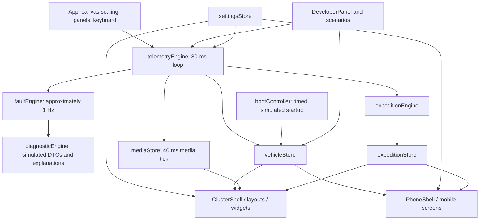

# Existing repository audit

Audit date: 2026-09-20. This records the repository **before the production-intent foundation changes**. Paths below refer to the original root-level application; after relocation, prepend `apps/simulator-web/` to `src/`, `tests/v4.test.tsx`, and `scripts/test-v4.mjs` references.

## What exists

RetroDrive is a functional browser HMI prototype built with React 18, TypeScript, Vite, Zustand, Lucide and Recharts. `src/main.tsx` mounts `src/app/App.tsx`. Its fixed 1024 x 600 cluster, simulated phone and development controls share four in-memory stores. This is substantial reusable visual work, not an empty scaffold. None of its connection indicators prove actual hardware communication.

The baseline root contains `src/`, `tests/`, `scripts/`, `docs/HMI-V4.md`, Vite/TypeScript configuration, package files and generated directories. The audit found 9,083 tracked paths, including `node_modules/` and `dist/`, and no `.gitignore`. Generated dependency/build content must leave the Git index while local installed dependencies can remain available for development.

## Baseline execution evidence

| Check | Baseline outcome | Meaning |
|---|---|---|
| `npm.cmd run build` | Passed, as run by the root task | TypeScript and Vite production bundle work |
| `npm.cmd test` | Failed at expected visual-profile count: 13 actual, 9 expected | Test expectations are stale; this is not a passing regression suite |
| Vite development server | Started on port 5173; HTTP GET returned 200 | Application can be served locally |
| Browser visual interaction | In-app browser unavailable in this session | No claim that every screen was visually tested |
| Physical device, phone BLE, CAN, K-Line, SD, GNSS, IMU | No executed hardware evidence | All remain unverified |

`scripts/test-v4.mjs` bundles `tests/v4.test.tsx` using esbuild, supplies fake localStorage/timers, patches React's store snapshot getter and performs server rendering. This is useful regression coverage, but it does not exercise browser layout, real animation timing, touches, audio output, native networking or physical hardware.

## Runtime architecture

| Module | Actual responsibility | Reuse decision |
|---|---|---|
| `app/App.tsx` | Owns engine lifecycle, developer keyboard actions, bezel/scaling, phone and developer visibility | Preserve shell; inject telemetry source at this composition boundary |
| `state/vehicleStore.ts` | Telemetry, connection flags, warnings, DTCs, health, trips, boot state, route crumbs | Preserve presentation state initially; normalize input through shared contract |
| `state/settingsStore.ts` | Version-4 persisted visual/vehicle/warning/sound settings | Preserve with explicit migrations and validated profile references |
| `state/mediaStore.ts` | Transport state, invented track list, randomized spectrum and peak hold | Preserve UI state; move synthetic generation behind simulation boundary |
| `state/expeditionStore.ts` | Attitude, drivetrain indicator state, waypoints and trail summaries | Preserve design model; separate sensor evidence, summaries and actual trail geometry |
| `simulator/telemetryEngine.ts` | Coupled speed/RPM/thermal/boost/GPS model, overrides, trip integration | Keep as mock source; never run it concurrently with a device source |
| `simulator/faultEngine.ts` | Local simulated warnings and six health categories | Reuse rule intent with validity-aware, independently tested domain rules |
| `simulator/diagnosticEngine.ts` | Synthetic DTC detection, freeze frame and deterministic mock explanations | Keep explicitly simulated; expose provider boundary |
| `simulator/scenarios.ts` | Timed scenarios using interpolated manual overrides | Keep for repeatable replay/QA, add controlled clock/seed where necessary |
| `audio/` | Web Audio synthesized alerts; browser gesture unlock | Preserve tonal design; firmware must implement independent audio |
| `vehicleProfiles/profiles.ts` | 13 visual personalities and mappings, no electrical/protocol verification | Preserve visual profiles separately from validated diagnostic profiles |

## Telemetry and persistence

`types/telemetry.ts` has `TelemetryChannel<T> = { value, available, source }`, with sources `OBD`, `GPS`, `EXTERNAL_SENSOR`, `DERIVED`, `SIMULATED`. Its `TelemetrySnapshot` is flat, containing vehicle measurements, location, derived trip statistics and cosmetic gear. It has no record sequence/time, per-field age, reason for invalidity, protocol identity, ECU responder identity or verification status.

The simulation constructs many samples as `OBD` or `GPS` even though no hardware supplied them. `mapKpa` and `mapAbsoluteKpa` have separate models; the former decreases with throttle while the boost model computes the latter from barometric pressure plus boost. They must not become two competing definitions of the same physical quantity in shared telemetry.

The vehicle store persists trip summaries, odometer and parked location; settings persist profile/display/sound/warning values; expedition persists waypoints, trail summaries and simulated drivetrain states. These are localStorage values, not SD logs or portable records. Breadcrumbs are capped at 400 points and are not persisted as a complete trail. Initial telemetry includes plausible synthetic values and an invented prior trip. Several hardware states start `CONNECTED` and most health categories start `NORMAL`, before any evidence arrives.

## Native versus simulated capability

| Feature | Works in browser | Missing production capability |
|---|---|---|
| Vehicle data | Physics model, manual overrides, scripted faults | CAN controller, ISO-TP, supported-PID discovery, K-Line/MEMS connection |
| Connection | Boot timers and buttons mutate flags | Protocol discovery, fingerprint validation, retry/backoff and device identity |
| Diagnostics | Rules create `SIMULATED` DTC records; detail/checklist/explanation screens | ECU Service 03 responses, ECU-origin confirmed DTC separation |
| Navigation | Local projection of synthetic GNSS breadcrumbs and manually supplied maneuver | Phone route provider, compact vector transfer, road geometry, freshness |
| GNSS and IMU | Synthetic position and pitch/roll | Receiver driver, calibration, sensor validity, stationary heading policy |
| Expedition | Mark waypoints, start flag, summary list, simulated drivetrain lamps | Durable trail data, save/load trail, actual return bearing and calibration offsets |
| Media | Track metadata, elapsed time, animated spectrum and decorative modes | Audio forwarding, real spectrum/audio synchronization, OS media session |
| Warning audio | Web Audio tones following user gesture | Local ESP32 audio path with priority/ducking independent of phone |
| Brightness | CSS filter, simulated ambient input | Backlight control and validated ambient hardware |
| Firmware update | No production implementation | Signature verification, version policy, partition/rollback and recovery |
| Storage | localStorage and in-memory arrays | Buffered SD logging, flush/shutdown, card-full/removal recovery |
| Phone app | React phone-shaped preview | Flutter/native Android/iOS, permissions, BLE and lifecycle handling |

## Highest-priority corrections

1. Preserve the 14 layouts and establish source adapters before adding a hardware transport. The App currently starts the mock loop unconditionally.
2. Extend validity semantics. Numeric zero must remain valid when measured; absent, unsupported, stale and malformed data must not turn into live zeros. Audit every direct `.value` consumer, including performance RPM, classic position, expedition heading and motion lockout.
3. Distinguish visual presets from supported vehicles. `types/vehicle.ts` labels the Mini preset “MPI” but sets year 1997 and engine “1.3i SPi”; the target brief is 1998 Mini MPi/MEMS 2J. Existing imaginative off-road presets are visual demonstrations, not identification evidence.
4. Keep ECU-origin confirmed DTCs separate from locally inferred patterns. Internal synthetic DTC source tagging exists, but simulated explanations are presented as “AI” in `mobile/DiagnosticDetailScreen.tsx`.
5. Remove universal attitude assumptions. `cluster/widgets/Inclinometer.tsx` hardcodes 18-degree pitch/roll caution. Add configurable, informational markers without asserting rollover safety. `zeroInclinometer()` only sets a boolean and applies no calibration offset.
6. Complete or honestly disable dead actions. Phone expedition `RETURN` and `TRIP` lack handlers; `COMPASS` invokes the incomplete zero function. `endExpedition()` returns null and does not save a trail. Media F6 has no handler, and several annunciators are decorative toggles.
7. Protect source ownership. Phone reconnect buttons force `CONNECTED`/`FIX`; developer actions alter ECU, GPS and hardware flags. Restrict these controls to mock mode before live transport becomes possible.
8. Make startup evidence-based for device mode. `bootController.ts` reports simulated links online on timers; timing currently schedules `STATUS_INIT` at 1250 ms before later lamp/RPM phases. Preserve animation but decouple self-test artwork from actual subsystem readiness.
9. Enforce capability-based gauges. Existing `utils/auxSlots.ts` is useful, but some views bypass availability or display “--” indefinitely. Do not synthesize oil pressure, fuel pressure, gear or boost as measured values in a real vehicle profile.
10. Fix repository hygiene and stale tests without losing the existing interface. Record browser QA and real hardware evidence independently of build success.

Complete screen/control inventory: [existing interface audit](../ui/existing-interface-audit.md). Migration: [UI reuse plan](../ui/ui-reuse-plan.md).
