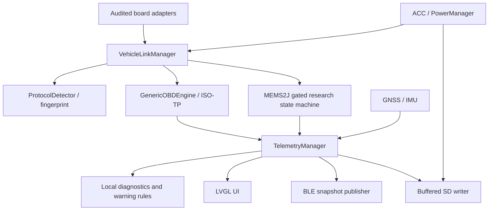

# Firmware architecture and initial build baseline

Status: proposed architecture, 2026-09-20. No Waveshare boot, timing, vehicle or production-security validation has been performed by this repository audit.

## Pinned baseline

| Dependency | Exact version | Reason and evidence | Validation still needed |
| --- | --- | --- | --- |
| ESP-IDF | `v5.5.5` | Upstream bugfix release on the 5.5 branch; ESP32-S3 target documented | Clean cross-build, USB-only boot, task/watchdog tests |
| LVGL | `8.4.0` | Waveshare lists this library for the 5/5B family; retain v8 API while porting the prototype | RGB timing, PSRAM bandwidth, touch, sustained frame rate |
| Core C++ language | C++14 portable subset | Host compiler available during audit; protocol code does not depend on ESP-IDF | Compile with strict warnings on host and IDF |

These are a selected integration baseline, not a claim that this particular pairing has already been validated on Waveshare hardware. Pin the IDF release in build instructions and CI; pin LVGL exactly in the component manifest when the display driver is integrated. Do not infer an IDF version from Arduino instructions. Record generated dependency locks only after actual resolution.

Sources: [ESP-IDF v5.5.5 release](https://github.com/espressif/esp-idf/releases/tag/v5.5.5), [ESP32-S3 setup](https://docs.espressif.com/projects/esp-idf/en/v5.5.5/esp32s3/get-started/index.html), [LVGL v8.4.0 release](https://github.com/lvgl/lvgl/releases/tag/v8.4.0), [Waveshare board documentation](https://www.waveshare.com/wiki/ESP32-S3-Touch-LCD-5).

## Hardware boundary

The 1024 × 600 touch variant is named **ESP32-S3-Touch-LCD-5B** in the manufacturer table; the 5 variant is 800 × 480. Confirm the purchased SKU, PCB revision and matching schematic before enabling any hardware adapter. See the hardware pin audit. The initial build must not configure guessed CAN, UART, audio or power-control pins.

`app_main` owns composition. Hardware drivers implement small transport interfaces; protocol components accept byte arrays, frames and monotonic timestamps. Only the hardware adapter configures GPIO. Simulator and host tests reuse protocol parsers and conversions without FreeRTOS or hardware headers.

The inspected family schematic does not provide unused externally accessible native UART/I2S pins for all requested additions. The Rev-A architecture therefore reserves an I2C-connected companion controller for precise K-Line timing, warning audio and power supervision. Its part, pinout and inter-controller protocol remain a design decision requiring validation. Do not implement timing-sensitive K-Line initialization by toggling a slow generic I2C expander. The portable state machine can run on the chosen companion as well as the host; no companion hardware support is claimed by the initial ESP-IDF scaffold.

## Responsibilities and task budget

| Work | Execution model | Failure handling |
| --- | --- | --- |
| VehicleIO | One queue-driven worker; deadline-based CAN/ISO-TP or K-Line state machines | Bounded retries, bus-off suspension, per-ECU timeout, no busy waiting |
| Telemetry + Diagnostics | One initial worker; immutable snapshots and explicit validity | Stale/invalid/unsupported distinct from valid zero; rules require valid data |
| GNSS + IMU | Timed work sharing a sensor worker initially | Fix loss, calibrated state, stale-data expiry |
| UI | Single LVGL-owning task | Bounded snapshot queue; retain alert visibility when link is lost |
| BLE | NimBLE host callbacks enqueue work; avoid vehicle operations in callbacks | Disconnect never stops local alarms |
| Storage | Low-priority buffered writer | SD absent/full/removal reported; bounded RAM buffer, dropped-record counter |
| PowerManager | Events delivered to supervisory worker | Flush deadline followed by documented hardware power-off path |

Task priorities and stacks are measurements to make, not guaranteed figures. Begin without per-sensor high-priority tasks. Measure stack high-water marks, queue overflow, heap/PSRAM availability, missed deadlines and frame rate under BLE/Wi-Fi/logging load. Feed watchdogs only after meaningful progress. All protocol timing uses monotonic time; UTC/GNSS time is metadata, not a communications timer.

## Discovery and telemetry

`VehicleLinkManager` first validates a stored fingerprint using a read-only request. Invalid or absent fingerprints enter passive CAN observation followed by bounded standard discovery. Retain protocol, bitrate, ID format, responders, supported bitmaps and profile version separately from optional VIN. Never infer exact vehicle identity from one PID bitmap; obtain user confirmation before selecting a named vehicle profile. A VIN timeout must still reach generic ready state.

Keep supported-PID maps per ECU. A selected engine ECU must not inherit a transmission ECU's capabilities. Poll only discovered data with configurable fast/medium/slow periods and a global request budget. A lower rate is preferable to a growing request queue. Mark stale data as stale and hide unsupported gauges.

Canonical external telemetry lives in `shared/schemas`; compact BLE layout lives in `docs/protocols/retrodrive-ble-protocol.md`. Preserve source ECU, provenance (`measured`, `calculated`, `simulation`) and timestamps through conversions. Rules emit separate inference/possible-cause records; confirmed DTCs require an actual ECU response.

## Local safety, shutdown and OTA

Normal operation accepts read requests only. No generic raw-command tunnel, calibration writing, immobilizer, actuator or DTC-clear command is exposed. Audio and local warnings remain independent of phone/cloud availability. Sensor loss generates a connection/validity warning; it does not synthesize temperature or pressure values.

ACC-off transitions to stopping acquisition, flushing logs with a bounded deadline, saving state, dimming/stopping the display and requesting load disconnect. Whether a shutdown hold signal is physically available is determined by the schematic. An OBD-only development installation needs explicit manual shutdown; a communications timeout is not proof that ignition is off.

Plan 16-MB partitioning with NVS, `otadata`, two OTA application slots and asset/log storage sized from actual binaries. Use signed firmware, certificate-checked HTTPS, target/version checks and first-boot self-tests before marking an image valid. Preserve a known-good slot and test interrupted download and failed first boot. Production key storage/provisioning and irreversible eFuse changes require a dedicated manufacturing procedure; development code does not silently burn eFuses. Credentials and signing keys remain outside Git. ESP-IDF rollback depends on `CONFIG_BOOTLOADER_APP_ROLLBACK_ENABLE` and the application validity calls; merely allocating two slots is insufficient. [ESP-IDF OTA reference](https://docs.espressif.com/projects/esp-idf/en/v5.5.5/esp32s3/api-reference/system/ota.html).

## Dependency order

1. Portable parser/conversion/state-machine tests and version-pinned build scaffold.
2. USB-only board/display bring-up using the confirmed schematic; theme assets derived from the existing UI.
3. CAN bench adapter, passive discovery and ISO-TP HIL tests.
4. Generic read-only live data, DTC and optional VIN; independent validation on a vehicle.
5. Audited K-Line hardware and recorded MEMS2J sessions before proprietary decoding.
6. GNSS/IMU, buffered SD, BLE phone link, local warning audio, power-off and OTA qualification.
