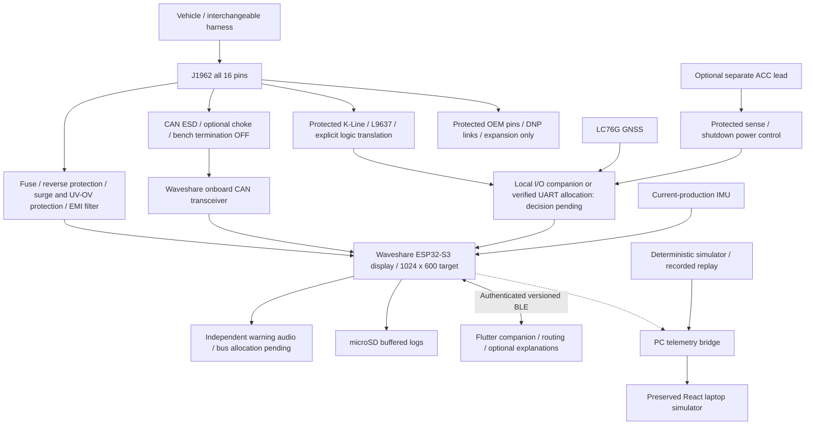

# RetroDrive system architecture

Status: production-intent engineering baseline, not a production release. All vehicle profiles are **unverified**. RetroDrive is an auxiliary instrument with a **multi-protocol expandable vehicle interface**; the original vehicle instruments remain authoritative.

## Architecture and trust boundaries

The exact module SKU/revision is a release gate. The Waveshare family includes different panel configurations; confirm the selected board against its schematic before setting GPIOs. Existing RGB, touch, CAN, SD, RS485, isolated I/O and external I2C claims must be reconciled per revision. No guessed GPIO assignment may enter firmware.

## Data flow

VehicleIO owns physical buses and bounded diagnostic request scheduling. Protocol decoders produce validated samples; TelemetryManager adds provenance, validity and age. Diagnostics uses valid local samples only, distinguishing measured evidence, calculations, inference and ECU-reported DTCs. UI, storage and BLE consume immutable snapshots through queues. A phone or cloud connection is never a dependency for warning evaluation or vehicle communication.

The laptop currently generates synthetic data in `src/simulator` and writes Zustand stores. Its first refactor introduces a `TelemetrySource` boundary while preserving gauges, layouts, settings and visual themes. The canonical JSON schema serves WebSocket/log/replay interchange; compact binary BLE encoding is a separate transport representation of the same semantics. Simulated data must retain simulated provenance.

## Safety and availability rules

- Normal communication permits diagnostic reads only. No raw ECU-command passthrough, remapping, actuator tests or write/calibration commands.
- VIN failure does not block generic OBD. A stored fingerprint is a hint until a valid reply confirms it. Exact vehicle selection requires confirmation; visual presets are not evidence of compatibility.
- Unsupported channels are absent; invalid samples have null values. Reconnect must clear old session data. Zero is a valid measurement, never a missing-data marker.
- Use the onboard CAN transceiver. Both onboard and daughterboard bench termination must be disabled for vehicle attachment.
- OEM/J1850/L-Line provisions remain electrically isolated from MCU drive unless a validated PHY and harness definition exist.
- ACC shutdown requires a bounded flush and eventual hardware power removal; OBD-only demonstration installations need a documented manual disconnect. Shutdown current is unmeasured.
- Navigation fallback follows recorded points or bearing. It does not establish terrain-safe routes. Pitch/roll caution markers are informational and vehicle-specific.

## Integration gates

1. Preserve and verify the laptop simulator; record actual baseline failures.
2. Review board identity, pin audit, schematic architecture, BOM and power calculations.
3. Test platform-independent protocol/schema code on the host; build an ESP-IDF project with hardware transmission disabled by default.
4. USB-only display bring-up, then a current-limited CAN bench and simulated ECU.
5. Review and bench-validate automotive power and K-Line circuits before vehicle attachment.
6. Connect to vehicles in the ordered phases in `ROADMAP.md`; promote profile status only with signed test evidence.
7. Release PCB/enclosure manufacturing assets only after ERC, DRC, dimensional validation and release checklist completion.

Detailed hardware decisions: [Rev-A architecture](../hardware/rev-a-schematic-architecture.md). Firmware: [architecture](firmware.md). UI: [reuse plan](../ui/ui-reuse-plan.md). Mobile: [architecture](mobile-and-ble.md).
