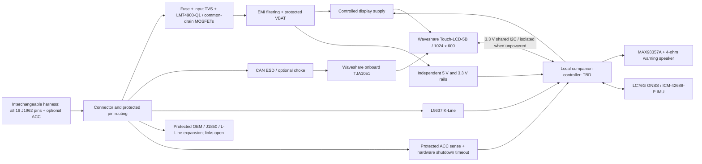

# Rev-A schematic architecture

Status: **design proposal, not an electrically complete schematic or manufacturing release**. Sheet and net names below are proposed RetroDrive names, not claimed existing KiCad files. Exact connector models, companion MCU, MOSFET/TVS coordination and physical dimensions must be closed before capture is released. Sources: [pin audit](waveshare-pin-audit.md), [source register](../../hardware/datasheets/source-register.md), [calculations](../../hardware/calculations/rev-a-calculations.md).

## Sheet 00: `00_top.kicad_sch`

The top sheet wires these exact child sheets: `01_vehicle_connector.kicad_sch`, `02_power_protection.kicad_sch`, `03_can_interface.kicad_sch`, `04_kline_interface.kicad_sch`, `05_oem_expansion.kicad_sch`, `06_acc_power_control.kicad_sch`, `07_gnss.kicad_sch`, `08_imu.kicad_sch`, `09_audio.kicad_sch`, `10_waveshare_interface.kicad_sch`, and `11_testpoints.kicad_sch`. These are capture requirements; actual KiCad files remain pending. Include interface direction/voltage annotations and default link/DNP configuration on the top sheet.

## Sheet 01: `01_vehicle_connector.kicad_sch`

J_VEHICLE brings all 16 positions onto the interface PCB. Use keyed locking interconnect rated for harness vibration; final part and mating-view drawing TBD. Pins 4 and 5 arrive as separate `CHASSIS_GND` and `SIGNAL_GND`. Power return uses pin 4 into the ground entry area; pin 5 joins there through a deliberate net-tie. Thereafter use one continuous PCB ground reference; do not make parallel return paths through a USB-connected laptop. Validate harness ground offsets and shield/ESD return routing. The net-tie is not galvanic isolation.

Pin 16 enters `TP_VBAT_RAW`, replaceable F1, an input bidirectional automotive TVS located near the connector, then the protection stage. TVS placement before the controller protects its raw-input pins; blindly placing the only TVS after the MOSFET pair leaves the controller exposed. Connector-side ESD/TVS energy return must remain short. No lithium backup battery is installed in the display by default.

## Sheet 02: `02_power_protection.kicad_sch`

U_PROTECT = LM74900-Q1 with the manufacturer's common-drain N-channel MOSFET topology. Q_REVERSE and Q_DISCONNECT are external AEC-Q101 candidates; exact MPN/ratings cannot be frozen until input transient and SOA analysis. Kelvin-connect R_SENSE. Bring out DGATE, HGATE, UVLO, OV, FLT and IMON test access. Include the required charge-pump/supply capacitors, gate slew components, UV/OV ladders, circuit-breaker timing and short-circuit threshold network. Follow datasheet pin names and reference topology during capture; do not interpret this block diagram as a pin-level netlist.

Provisional UVLO/OVLO/current calculations are in the calculation record. Normal overload protection is a circuit breaker, not constant-current regulation. Choose latch-off behavior/reset procedure appropriate to a shorted harness and validate it. Use OV **cutoff**, not sustained linear load-dump clamping, unless a later SOA analysis specifically approves that mode. Apply input filtering after the protection stage, damping as required. Outputs: `VBAT_PROTECTED`, `TP_VBAT_PROTECTED`.

## Sheet 06: `06_acc_power_control.kicad_sch`

Derive independent 5 V (audio/auxiliary) and 3.3 V (companion/sensors) rails from protected VBAT; final automotive regulators and magnetics TBD. Do not assume spare current from the Waveshare 3.3 V terminal. Provide `TP_5V`, `TP_3V3`, `TP_GND`. A controlled display branch produces `VIN_DISPLAY` and `TP_VIN_DISPLAY` into the manufacturer's 7-36 V input. No cold-crank ride-through claim: the display input minimum remains the limiting requirement.

The supervisor/companion receives protected ACC, keeps display power present during an ACC-off grace period, signals the ESP32, waits for persisted-state acknowledgment, then disables the display and other loads. An independent maximum-on timer must handle a stalled ESP32/companion. Always-on wake/supervisory supply design and measured drain remain TBD. Any upstream always-on rail requires its own reverse/transient protection; do not feed a low-voltage LDO directly from raw VBAT. All sensor, UART and I2C links must prevent phantom powering a disabled display. Bench switch mode is explicit; OBD-only demo mode requires a visible manual-off/timeout policy.

## Sheet 03: `03_can_interface.kicad_sch`

OBD6 -> CAN-H protection -> display CAN-H; OBD14 -> CAN-L protection -> display CAN-L. Use the display's TJA1051T/3/1J, retain TWAI15/16. Daughterboard protection is at the harness entry; account for onboard ESD capacitance. Optional common-mode choke footprint with bypass configuration. Optional 120-ohm resistor and jumper are DNP/open for vehicle assembly; onboard display termination must also be OFF. `TP_CAN_H`, `TP_CAN_L`, ground test access. Keep pair together over continuous reference, minimize stubs, determine impedance from selected fabricator stackup.

## Sheet 04: `04_kline_interface.kicad_sch`

OBD7 routes through appropriate automotive transient/series protection, test point `TP_KLINE`, and a default K-Line link to L9637 pin K. `VS` follows a suitable protected battery-related rail; `VCC` uses 3.3 V. Decouple locally. RX/TX go only to the 3.3 V companion UART with accessible UART test pads, idle-state control, and series damping selected after timing analysis. Protect against the vehicle keeping K high while local supplies are off. Alternative routing links start open and are mutually exclusive.

Provide a configurable K pull-up consistent with L9637 loading, test vehicle conditions and pull-up power calculation. Never add a low-voltage MCU ESD clamp directly on K. LI is the **L receiver input** and LO its logic output; neither is an L transmitter. Pin15 goes to the protected expansion area; active L initialization requires a separate later open-collector driver, DNP in Rev-A.

## Sheet 05: `05_oem_expansion.kicad_sch`

Pins 1,2,3,8,9,10,11,12,13,15 each get a raw-labeled test pad, automotive-compatible ESD/protection footprint, series protection position, protected test pad, and normally open 0-ohm link/jumper toward a future interface header. Raw electrical limits and series/ESD capacitance must be chosen with the eventual protocol; unvalidated components/links stay DNP. These are not 3.3 V GPIO. Pins2/10 reserve J1850 with PHY DNP. No electronic routing matrix or MCU drive is populated. See [OEM expansion](oem-expansion.md).

## Sheet 10: `10_waveshare_interface.kicad_sch`

Waveshare I2C terminal carries 3.3 V SDA/SCL plus reference ground only; exact mating-pin table comes from the audited terminal orientation. Fail-safe bus isolation, address allocation, timeout and stuck-bus recovery are required. Companion requirements: real UART that can generate/receive timed K initialization, I2S output, watchdog, ADC for ACC/power, flash update/service port, safe pins at reset, low-power wake. Select controller only after peripheral/pin and lifecycle review. Tone IDs and K transactions use bounded mailbox commands, not sampled I2S streamed over I2C.

## Sheet 07: `07_gnss.kicad_sch`

Prototype with the sourced Waveshare LC76G module and antenna, recording exact Quectel variant/firmware. Prefer companion UART if shared I2C transactions conflict; both alternatives are documented, not simultaneously strapped. Provide reset, PPS test access and service UART pads. Breakout supply is not interchangeable with bare module supply. Final antenna feed, bias, connector, backup behavior and mounting keep-out require exact module/antenna documents.

## Sheet 08: `08_imu.kicad_sch`

ICM-42688-P at 3.3 V, local decoupling, defined CS/address straps, documented axes; isolate placement from speaker and board flex. Select direct shared I2C or companion I2C after the complete address audit; interrupt can be companion-owned. Polling is an acceptable bring-up mode. Optional magnetometer connector is DNP/unselected. Reserve calibration storage and a fixture datum, not a universal rollover angle.

## Sheet 09: `09_audio.kicad_sch`

MAX98357A at 5 V, companion I2S, gain/mode straps, default shutdown while clocks are invalid, local bulk and high-frequency decoupling. 4-ohm speaker between OUTP/OUTN; neither output is ground. Reserve EMI filter footprints if lead length/testing requires them. Local tone library supports priority and ducking under ESP32 requests; disconnect alert must work without a phone. Exact speaker and acoustic enclosure remain TBD.

## Sheet 11: `11_testpoints.kicad_sch`

Add every named test point from the brief, companion programming connector, protection/fault debug access, keyed polarity labels and board revision. Proposed zones A-I follow connector/protection, power, CAN, K-Line, expansion, sensors, GNSS, audio and Waveshare connectors. Use four layers with L2 continuous GND. Manufacturer stackup, outline, mounting holes and enclosure fit are held until drawings/measurements are checked. No fabricated hole coordinates or trace-impedance numbers.

## Capture/release gates

Before PCB layout: exact board identity; companion decision; complete BOM and footprints; protection worst cases; harness connector pin-view audit; startup/shutdown truth table; antenna plan; ERC with no unexplained exceptions. Before fabrication: actual stackup, placement/return-path review, DRC, power/thermal review, schematic-to-BOM cross-check and manufacturing checklist. An architectural document does not satisfy those gates.
